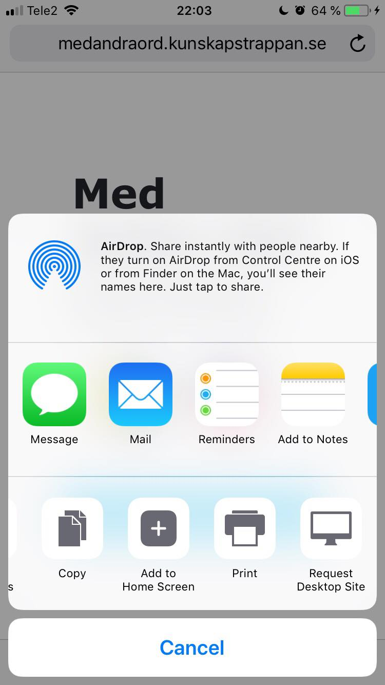
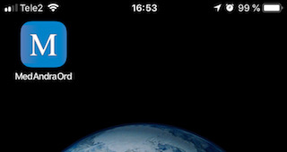
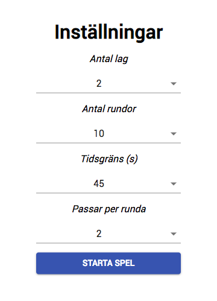
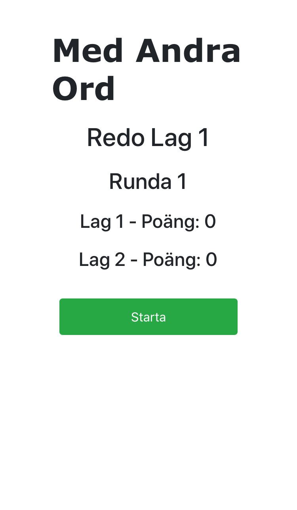
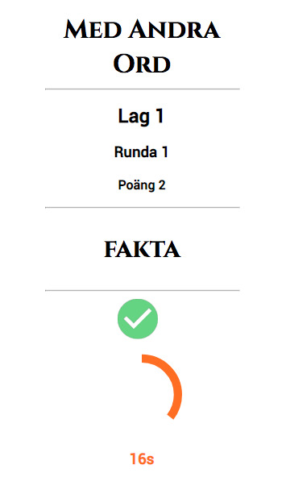

Med Andra Ord / With Other Words
=====

## How to get started

In terminal:
```
$ git clone git@github.com:lindbergan/withotherwords.git
$ cd app/client/
$ yarn start
```
Go to `localhost:3000` to view application.

## Screenshots
#### Home page


#### Add to Home Screen


#### App on Home Screen


#### Settings


#### Ready to play?


#### Game in action

